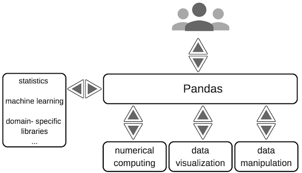
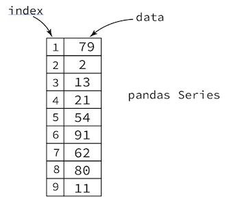
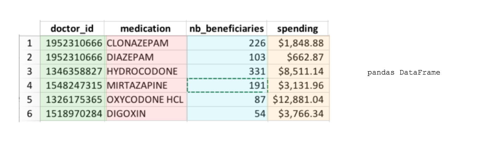
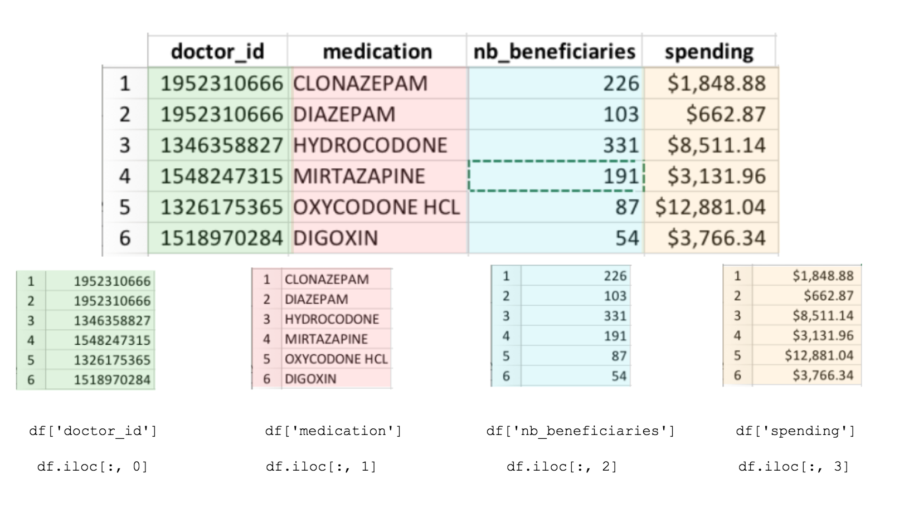
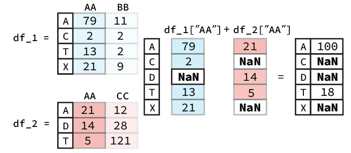
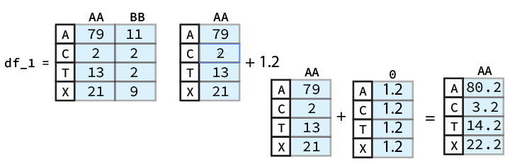

# Introduction to the `pandas` `Python` Package For Data Wrangling

## What is Data Wrangling? Why pandas?

---

*Data Wrangling* is the process of transforming your data from one form into another, usually with the intent of making it more suitable for analysis.

`pandas` is the de facto package for wrangling your data. `pandas` provides an abundace of functionality for each step of the data wrangling workflow from reading and writing various files formats, to cleaning your data, to merging data sets, all of which we will learn how to do by the end of this course.



# `pandas` Data Structures

---


**`Series` Vs. `DataFrames`**
  1. `Series`: list-like objects that store data in a given order.
  2. `DataFrames`: spreadsheet-like tables that contain one or more Series.

**`Series`**
* To create a series from native `Python`  data structures we use the `pandas` `Series()` function

  

**`Series` Attributes and Methods**

| Attribute |Description|
|:----------|-----------|
| `dtype`| return the dtype object of the underlying data |
| `name`| return the name of the Series |
| `size`| return the number of elements in the underlying data |
| `values`| Return Series as ndarray or ndarray-like|


| Method |Description|
|:----------|-----------|
| `add(other[, level, fill_value, axis])` | 	Addition of series and other, element-wise (binary operator add) |
| `nlargest([n, keep])`| Return the largest n elements. |
| `sort_values([axis, ascending, inplace, ...])`| Sort by the values along either axis |
| `sum([axis, skipna, level, numeric_only, ...])`| 	Return the sum of the values for the requested axis |
| `unique()`| Return unique values in the object |

To call a Method or access an Attribute of the `Series` object, we use *dot* notation:

```python
>>> s1.size
4
>>> s1.unique()
[1234 'DIAZEPAM' 3 '$32']
```

More Attributes and Methods be found at the <a href="https://pandas.pydata.org/pandas-docs/version/0.22/generated/pandas.Series.html">pandas documentation</a> webpage.

**`DataFrames`**
* To create a series from native `Python`  data structures we use the `pandas` `DataFrame()` function

  

**`DataFrame` Attributes and Methods**

| Attribute |Description|
|:----------|-----------|
| `T`|  Transpose index and columns |
| `dtype`|  Return the dtypes in this object |
| `shape`| Return a tuple representing the dimensionality of the DataFrame |
| `size`| number of elements in the NDFrame |
| `values`| 	Numpy representation of NDFrame |

| Method |Description|
|:----------|-----------|
| `add(other[, axis, level, fill_value])`|  	Addition of dataframe and other, element-wise (binary operator add) |
| `count([axis, level, numeric_only])`|  	Return Series with number of non-NA/null observations over requested axis |
| `describe([percentiles, include, exclude])`| Generates descriptive statistics that summarize the central tendency, dispersion and shape of a dataset’s distribution, excluding NaN values.|
|`head([n])`|Return the first n rows.|

- To call a method or access an attribute we again use *dot* notation.

```python
>>> df2.values
array([[1234, 'DIAZEPAM'],
       [3210, 'CLONAZEPAM']], dtype=object)
>>> df2.count()
doctor_id     2
medication    2
dtype: int64
```

All `DataFrame` attributes and methods can be found at the <a href="https://pandas.pydata.org/pandas-docs/version/0.22/generated/pandas.DataFrame.html#pandas.DataFrame">pandas documentation</a> webpage.

**Accessing Data from the `DataFrame`**

| Syntax                |   Meaning    |
|:--------------------------|:-------------------|
| `dataframe["col_name"]`    |  Return `Series` of "col_name"'s  |
| `dataframe[["col_name_1", "col_name_2"] ]`    |  Returns `DataFrame` with  "col_name_1" and "col_name_2"|
| `dataframe.loc["label",:]`| returns row indexed by "label" |
| `dataframe.loc["label", ["col_3", 'col_5']]`| return entry indexed by "label", subsets columns to only "col_3" and "col_5" |
| `dataframe.loc[["label_1", "label_2"], ['col_3', 'col_5']]`| returns lines with indices "label_1" and "label", subsets columns to only "col_3" and "col_5" |
| `dataframe.iloc[23, [0, 1]]`| returns line 23, and only values of columns 0 and 1 |
| `dataframe.iloc[[1,2], [0, 1]]`| returns lines 1 and 2, and only values of columns 0 and 1 |

  

**Modifying Series and DataFrames**

* Most of the pandas methods for modifying the data in a `Series` and `DataFrame` will, by default, not alter the original object, rather a **copy** with the desired changes is made. If you are confident of the operation you are performing on the object and do not care to make a copy, then many times you can pass the optional argument  "`inplace=True`" to the pandas method you are calling and the original object will be altered **inplace**.

* To add columns to `DataFrames` we have 2 options:

    1. Modify the `DataFrame` in place: use the `assign()` `DataFrame` method.
    2. Make a new `DataFrame` from a copy of the original with the desired additions: first reference and then designate values to columns that don't yet exist.

* We may drop both Rows and Columns from a `DataFrame` using the `drop()` method.
  * The `drop()` method takes a positional parameter which is the label of the row or column that is going to be dropped.
  * The `drop()` method will drop a row or a column depending on the value that the `axis` parameter is set to.
    * If the `axis` parameter is set to 'columns' then we are dropping a column with the specified name, otherwise if the `axis` parameter is set to 'rows' then we are dropping a row with the specified name.

# Data Loading and Storage

---


Some of the parameters of `read_csv` and `read_table` can be seen below:


# `DataFrame` Attributes and Arithmetic

---

**Summarizing Your Data**

* Important Attributes:

| Attribute |Description|
|:----------|-----------|
| `shape`| Return a tuple representing the dimensionality of the DataFrame. |
| `size` | Return an int representing the number of elements in this object.  |
| `dtypes` | Return the dtypes in the DataFrame. |

* Important Methods:

| Method|Description|
|:----------|-----------|
| `head()`| Return the first n rows. |
| `tail()` | Return the last n rows. |
| `min()`, `max()` | Computes the numeric (for numeric value) or alphanumeric (for object values) row-wise min, max in a Series or DataFrame|
| `sum()`, `mean()`, `std()`, `var()`   |  Computes the row-wise sum, mean, standard deviation and variance in a `Series` or DataFrame|
|`nlargest()`|	Return the first n rows ordered by the spceified columns in descending order. |
| `count()` |  returns the number of non-NaN values in the in a `Series` or `DataFrame` |
| `value_counts()` |  returns the frequency for each value in the `Series` |
| `describe()` | Computes row-wise statistics |


**Arithmetic and Data Alignment**

* When executing an arithmetic operation between `Series` or `DataFrames`, the object will first be extended and then aligned by their indices and then the arithmetic will be applied in a pairwise fashion, this is called *vectorized arithmetic between `Series` or `DataFrames`*



* When executing an arithmetic operation between constants and `Series` or `Dataframes`, the constant will be extended to a new `Series` or `DataFrame` to align with the first `Series` or `Dataframe` and then the arithmetic will be applied in a pairwise fashion, this is referred to as *broadcasting*



# Subsetting and Sorting

**Subsetting**

* Comparison operators are ideal for querying and subsetting the `DataFrame`
* We can subset a `Series` using another equally sized list (or a `Series`) of `Boolean`s


**Sorting**

* To sort a `DataFrame` by the values in one of its columns we use the [`pandas` `DataFrame` `sort_values()` method](https://pandas.pydata.org/pandas-docs/stable/generated/pandas.DataFrame.sort_values.html)

**Data Visualization**

* The `plot` method that may be called by any `pandas` `DataFrame` is quite versatile and can make the following kinds of plots:

| Kind |Description|
|:----------|-----------|
| `line`| line plot (default) |
| `bar` | vertical bar plot  |
| `barh` | horizontal bar plot |
| `hist` | histogram |
| `box` | boxplot  |
| `kde` | Kernel Density Estimation plot |
| `area` | area plot |
| `pie` | pie plot |
| `scatter` | scatter plot |
| `hexbin` | hexbin plot |

  * To learn more about the `plot` method please see the [pandas Documentation](https://pandas.pydata.org/pandas-docs/stable/generated/pandas.DataFrame.plot.html#pandas.DataFrame.plot)

# Data Preperation and Cleaning

**Reindexing**

* Reindexing a `DataFrame` or `Series` will create a **new** `pandas` object that is conformed to the new index
* More information about the `reindex()` method is available [here](https://pandas.pydata.org/pandas-docs/stable/generated/pandas.DataFrame.reindex.html)

**Inspecting and Modifying Data Types**

* Use the `DataFrame dtypes` attribute to inspect the `pandas` data types of each column
* To cast a column of one type to another compatible type we can use the `astype() Series` method

**Series String Methods**

* `Series` contains various `string` processing methods that can be accessed using a `Series`’s `str` property.
* You can use .__`TAB`__ to explore these methods.
* Or you can see all of the `Series str` methods and descriptions [here](https://pandas-docs.github.io/pandas-docs-travis/api.html#string-handling)

**Handling Missing Data**

* The  `isnull` method is often useful to find where all the `NaNs` precisely are in the `pandas` `DataFrame` or `Series`

* **Filtering**

  * You can discard missing values using `isnull()` result and subsetting

* **Filling**

  * There  are two conventional approaches for filling missing value:

    1. Filling the value with a constant
    2. Filling the value dynamically with something computed on the fly

# Function Application and Mapping

* **Global Processing**
  * To apply a function to every row or column in a `DataFrame` we can use the `apply()` method
  * To apply a function to every element in a `Series` we can use the `map()` method
  * To apply a function to every element in a `DataFrame` we can use the `applymap()` method

* **Group Specific Processing**

  * The `groupby()` method is used to group the data using values on one or more columns

  * `groupby()` is often applied in the context of the data processing paradigm called "split-apply-combine"
    * **Split**: you need to split the data into chunks defined using one or more columns
    * **Apply**: apply some operation on the chunks generated.
    * **Combine**: combine the results of the applied operation into a new `DataFrame`

  * There are 3 common classes of split-apply-combine operations that can be applied to group data.

    1. __Aggregations__ generate a single value for each group

    2.  __Transformations__ convert the data and generate a group of the same size as the original group.

    3.  __Filters__ retain or discard a group based on group-specific boolean computations.

# Combining `DataFrames`

---


**Merging**

* The `DataFrame` method  [`merge()`](https://pandas.pydata.org/pandas-docs/stable/generated/pandas.DataFrame.merge.html) implements merging `DataFrames`.

* `merge()` operates by default on `columns` with the same name across the `DataFrames`, that is the intersection of the columns.

  * This default behavior can be modified by explicitly passing a column name (label) to the parameter `on`

* When merging `DataFrames` there are 4 principal strategies, and those are:

| Merge strategy | Description |
|:--------|:-------------|
| `inner` | Keep keys that are present in both tables (intersection) |
| `left` | Keep keys found in left table and set the values in the right table to `NaN`  |
| `right` | Keep keys found in right table set values in the left table to `NaN` |
| `outer` | Keep the union of keys found in both right and left tables |

* `merge()` can perform a different merging strategy by setting the `how` parameter

**Concatentation**

* Concatenation in Python is done using the `concat()` `pandas` function.

* Concatenation is an outer or inner join with keys restricted to either the indices or columns.

* By setting `axis=0`(default), `concat()` will stack rows,  while `axis=1` will tell `concat()` to stack columns. The `join` parameter can either be set to 'outer' (default) or 'inner', to perfrom an outer or inner join respectively.


```python

```
